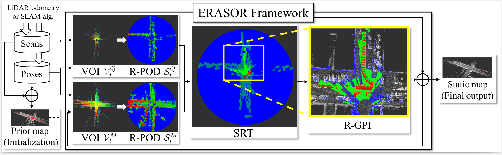
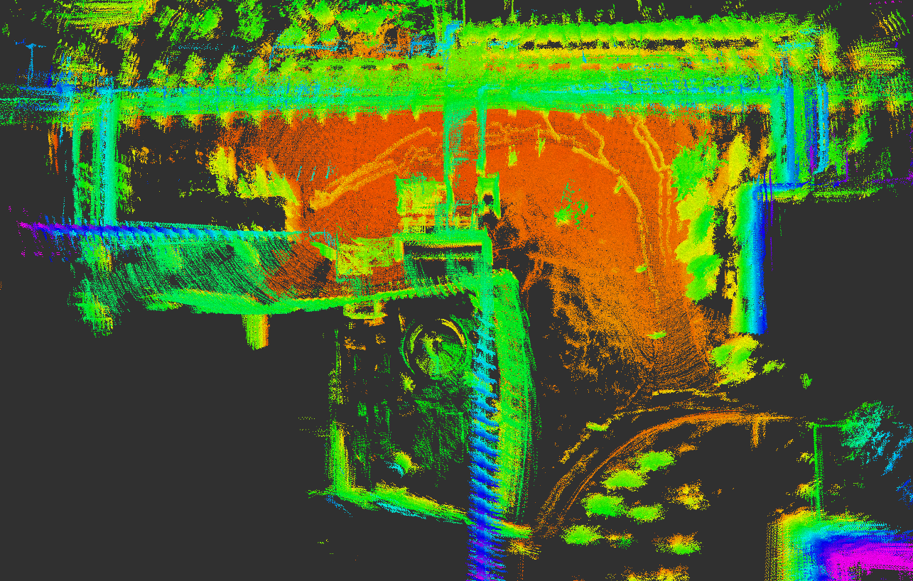
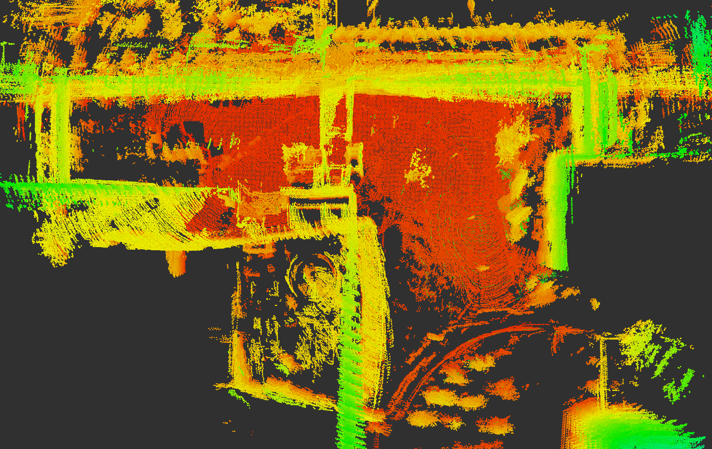

# :rainbow: ERASOR (RA-L'21 with ICRA Option)

Official page of **ERASOR** is in [*"ERASOR: Egocentric Ratio of Pseudo Occupancy-based Dynamic Object Removal for Static 3D Point Cloud Map Building"*](https://github.com/LimHyungTae/ERASOR)
[[Video](https://www.youtube.com/watch?v=Nx27ZO8afm0)] [[Paper](https://ieeexplore.ieee.org/stamp/stamp.jsp?tp=&arnumber=9361109)] 

## 动态环境建图｜在自己的数据集上使用ERASOR
ERASOR的输入是先自己打包成node的数据格式才可以使用，该仓库用自己的数据集来跑ERASOR。

## Test Env.
The code is tested successfully at
* Linux 20.04 LTS
* ROS Noetic

## 实验过程
参见链接：[https://zhuanlan.zhihu.com/p/644567952?](https://zhuanlan.zhihu.com/p/644567952?)

**效果：**
<table>
  <thead>
    <tr>
      <th colspan="6">在两个数据包上的效果</th>
    </tr>
  </thead>
  <tbody>
    <tr align="center">
      <td> bag1 </td><td> bag2 </td>
    </tr>
  </tbody>
  <tbody>
    <tr>
      <td> 

 </td>
      <td> 

 </td>
    </tr>
  </tbody>
  <tbody>
    <tr>
      <td> 

 </td>
      <td> 

 </td>
    </tr>
  </tbody>
</table>

## Citation 
If you use the code or method in your work, please consider citing the following:

	@article{lim2021erasor,
    title={ERASOR: Egocentric Ratio of Pseudo Occupancy-Based Dynamic Object Removal for Static 3D Point Cloud Map Building},
    author={Lim, Hyungtae and Hwang, Sungwon and Myung, Hyun},
    journal={IEEE Robotics and Automation Letters},
    volume={6},
    number={2},
    pages={2272--2279},
    year={2021},
    publisher={IEEE}
    }

